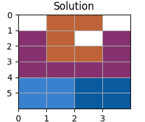

# Решение задачи вымощения ограниченной плоскости 

## Краткая постановка задачи
Необходимо определить, возможно ли выполнить замощение ограниченной плоскости, используя прямоугольные полиомино и П-полиомино с заданными параметрами.

## Решение
Для решения поставленной задачи использовалась библиотека [ortools](https://developers.google.com/optimization/cp/cp_solver) 
для определения возможности замощения стола прямоугольниками и П-полиомино с заданными параметрами. Методы используемой 
библиотеки не позволяют учитывать вращения фигур, для решения возникшей проблемы в коде вычисляются все возможные 
комбинации с ротациями прямоугольников и П-полиомино, что влечет за собой временную сложность $O(k*4^n+k*2^n)$, $4^n$ 
возникает из-за перебора П-полиомино, а $2^n$ - из-за перебора прямоугольников. 
Предполагаю, что сложность по памяти так же составляет $O(k*4^n+k*2^n)$, поскольку память выделяется на создание объектов
при каждой итерации. 

На графике показана зависимость времени от общей площади прямоугольников, поданных на вход программе.


## Пример работы

### Входные данные
Пользователю предлагается ввести размер таблицы, количество типов прямоугольников и параметры самих прямоугольников, 
количество типов П-Полиомино и параметры самих П-полиомино. 

### Примечание
Под количеством типов фигур предполагается количество уникальных пар параметров. 
Например, для прямоугольников (2, 3) и (3, 2) - это 1 тип, а (2, 3) и (2, 4) - это 2 типа.  

Цвета прямоугольников генерируются случайным образом, возможны некоторые совпадения цветов фигур.
### Положительный пример
Введем размер таблицы 4х6, 2 квадрата 2х2, П-полиомино 3x4, П-полиомино 2х3 и получим решение. 
```
>> Enter table's width and height: 
4 6
>> Enter total rectangles type amount: 
1
>> Enter width, height and amount of rectangles:
2 2 2
>> Enter total p-polyominoes type amount:
2
>> Enter width, height and amount of p-polyominoes:
3 4 1
>> Enter width, height and amount of p-polyominoes:
2 3 1
You entered:
table size: (4, 6)
rectangles: [(2, 2), (2, 2)]
p-polyominoes: [(3, 4), (2, 3)]
Solution is found!
```


### Отрицательный пример
Приведем пример отсутствия решения.
В таблицу 4х6 невозможно упаковать 2 квадрата 2х2 и прямоугольник 1х7.
```
>> Enter table's width and height: 
4 6
>> Enter total rectangles type amount: 
2
>> Enter width, height and amount of each rectangle: 
2 2 2
>> Enter width, height and amount of each rectangle: 
1 7 1
>> Enter total p-polyominoes type amount:
0
You entered:
table size: (4, 6)
rectangles: [(2, 2), (2, 2), (1, 7)]
p-polyominoes: []
Solution is not found!
```

## Инструкции для запуска
Запустить программу можно двумя способами:
1. Локально
   - Скачать репозиторий любым удобным методом.
   - Установить все необходимые зависимости. 
   - Запустить main.py.
2. Онлайн
   - Перейти по ссылке в [Google Colab](https://colab.research.google.com/drive/1Tsn-UoQWlSJ2Vmezj21_dEWBoAF39yJK?usp=sharing).
   - Запустить блок ячеек 'Исходный код' для загрузки библиотек и инициации классов.
   - Запустить блок 'Запуск задачи' для ввода параметров.
