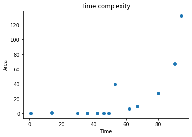
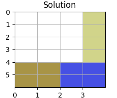

# Решение задачи вымощения ограниченной плоскости 

## Краткая постановка задачи
Необходимо определить, возможно ли выполнить замощение ограниченной плоскости, используя прямоугольные полиомино и П-полиомино с заданными параметрами.

## Решение
Для решения поставленной задачи использовалась библиотека [ortools](https://developers.google.com/optimization/cp/cp_solver) 
для определения возможности замощения стола прямоугольниками с заданными параметрами. Методы используемой библиотеки не 
позволяют учитывать вращения прямоугольников, для решения возникшей проблемы в коде вычисляются все возможные комбинации 
с ротациями прямоугольников, что влечет за собой сложность O(n^2).

На графике показана зависимость времени от общей площади фигур, поданных на вход программе.



В ходе решения не удалось выполнить задачу для П-полиомино. **Программа работает только для прямоугольных полиомино.** 

## Пример работы

### Входные данные
Пользователю предлагается ввести размер таблицы, количество типов прямоугольников и параметры самих прямоугольников. 

### Примечание
Под типом прямоугольника предполагается количество уникальных пар параметров. 
Например, (2, 3) и (3, 2) - это 1 тип, а (2, 3) и (2, 4) - это 2 типа.  

Цвета прямоугольников генерируются случайным образом, возможны некоторые совпадения цветов фигур.
### Положительный пример
Введем размер таблицы 4х6, 2 квадрата 2х2 и 1 прямоугольник 1х4 и получим решение. 
```
Enter table's width and height: 
>> 4 6
Enter total rectangles type amount: 
>> 2
Enter width, height and amount of each rectangle: 
>> 2 2 2
Enter width, height and amount of each rectangle: 
>> 1 4 1
You entered:
table size: (4, 6)
rectangles: [(2, 2), (2, 2), (1, 4)]
Solution is found!
```


### Отрицательный пример
Приведем пример отсутствия решения.
В таблицу 4х6 невозможно упаковать 2 квадрата 2х2 и прямоугольник 1х7.
```
Enter table's width and height: 
>> 4 6
Enter total rectangles type amount: 
>> 2
Enter width, height and amount of each rectangle: 
>> 2 2 2
Enter width, height and amount of each rectangle: 
>> 1 7 1
You entered:
table size: (4, 6)
rectangles: [(2, 2), (2, 2), (1, 7)]
Solution is not found!
```

## Инструкции для запуска
Запустить программу можно двумя способами:
1. Локально
   - Скачать репозиторий любым удобным методом.
   - Установить все необходимые зависимости. 
   - Запустить main.py.
2. Онлайн
   - Перейти по ссылке в [Google Colab](https://colab.research.google.com/drive/1Tsn-UoQWlSJ2Vmezj21_dEWBoAF39yJK?usp=sharing).
   - Запустить блок ячеек 'Исходный код' для загрузки библиотек и инициации классов.
   - Запустить блок 'Запуск задачи' для ввода параметров.
